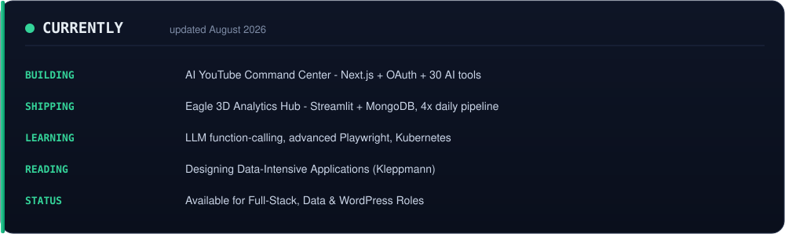

<div align="center">

<a href="https://portfolio-ayaz.netlify.app">
  
</a>

<a href="https://portfolio-ayaz.netlify.app"></a>&nbsp;
<a href="https://www.linkedin.com/in/fozayel-ibn-ayaz/"></a>&nbsp;
<a href="mailto:ibnayaz789@gmail.com"></a>&nbsp;
<a href="https://github.com/fozayelibnayaz/AI-YouTube-Command-Center"></a>

<br />

<a href="https://github.com/fozayelibnayaz"></a>

<br /><br />

<a href="https://github.com/fozayelibnayaz"></a>
<a href="#-lets-talk"></a>
<a href="https://portfolio-ayaz.netlify.app"></a>
<a href="https://github.com/fozayelibnayaz"></a>
<a href="https://github.com/fozayelibnayaz"></a>


</div>

---

<div align="center">

<a href="#-the-60-second-version"></a>
<a href="#-who-i-am"></a>
<a href="#-tech-arsenal"></a>
<a href="#-featured-work"></a>
<a href="#-github-analytics"></a>
<a href="#-experience"></a>
<a href="#-lets-talk"></a>

</div>

---

## ⚡ The 60-second version

<table>
<tr>
<td width="50%" valign="top">

**I work where most projects quietly fail** — in the gap between *code*, *data* and *deployment*.

A feature isn't "done" when it merges. It's done when the tracking fires, the Core Web Vitals hold, the dashboard tells the truth, and nobody wakes up at 3 AM.

That's the whole job description.

</td>
<td width="50%" valign="top">

|  |  |
|---|---|
| 📍 **Based** | Dhaka, Bangladesh 🇧🇩 |
| 🎓 **Degree** | BSc CSE — North South University |
| 💼 **Now** | WordPress Dev @ Ekomedia · Data Analyst @ Eagle 3D Streaming |
| 🧭 **Focus** | Full-Stack + Analytics + ML |
| 🌍 **Language** | English (IELTS 6.5 / B2) · বাংলা native |
| ☕ **Fuel** | Strong tea, clean commits, dashboards that match revenue |

</td>
</tr>
</table>

<div align="center">



</div>

---

## 👨‍💻 Who I am

<div align="center">

```text
       _,met$$$$$gg.            ayaz@ubuntu-dualcore:~
    ,g$$$$$$$$$$$$$$$P.         ─────────────────────────────────────
  ,g$$P"     """Y$$.".          OS       Ayaz Linux (Ubuntu 24.04 LTS)
 ,$$P'              `$$$.       Host     Full-Stack Dev ✦ Data Analyst ✦ WordPress
,$$P       ,ggs.     `$$b:      Packages React, Next.js, TypeScript, WordPress,
`d$$'     ,$P"'   .    $$$               ACF, GA4, GTM, Looker, Python
 $$P      d$'     ,    $$P      Shell    zsh / bash 5.2
 $$:      $.   -  ,d$$'         Uptime   2017 — Present (North South University)
 $$;      Y$b._   _,d$P'        Location Dhaka, Bangladesh (UTC+6)
 Y$$.    `.`"Y$$$$P"'           Status   ✅ Available for hire
  `$$b      "-.__               Contact  ibnayaz789@gmail.com
```

</div>

<details>
<summary><b>🔍 Expand: my engineering philosophy (5 rules I actually follow)</b></summary>

<br>

**1. Ship the boring foundation first.**
Authentication, error states, empty states, logging. The parts nobody screenshots are the parts that decide whether a product survives contact with real users.

**2. If it isn't measured, it's a guess.**
I configure GA4 + GTM *before* the marketing team asks. Consent-aware triggers, clean dataLayer naming, revenue events that reconcile with actual transactions. I have caught tracking discrepancies that would have quietly skewed months of reporting — that's a better story than any hero section.

**3. Speed is a feature you can measure.**
Image compression, lazy loading, CSS/JS de-bloating, critical-path rendering. Core Web Vitals isn't an SEO checkbox, it's how long a customer stays.

**4. Design-to-production should lose nothing.**
I take Figma comps and rebuild them pixel-faithfully myself — no "we'll get to it in v2." Then I run cross-browser + schema validation before go-live.

**5. Automate the repetition, keep the judgment.**
GitHub Actions cron jobs run my notification pipelines 4× daily with 15-minute anomaly detection. Machines handle the clock; I handle the "is this actually a problem?" call.

</details>

<details>
<summary><b>🎯 What hiring me gets you (the plain-English version)</b></summary>

<br>

- **One person, three disciplines.** Most teams pay three people to argue across the frontend ↔ analytics ↔ infra boundary. I live on that boundary.
- **Client-facing reliability.** I've owned WordPress properties reporting directly to a company director — requirements, architecture, launch, Tier 2/3 support.
- **Real numbers, not vibes.** Looker Studio dashboards tracking subscriber growth, conversion rate, watch-time and revenue, used weekly by leadership for decisions.
- **QA before the client finds it.** Playwright for E2E, Postman for APIs, Rich Results validation for SEO. Zero post-launch defects is the target, not the slogan.

</details>

---

## 🛠 Tech Arsenal

<div align="center">



<br>



<br>



<br>



<br>



</div>

<details>
<summary><b>📜 Full stack in badge form (everything, no filters)</b></summary>

<br>

<div align="center">

**⚡ Frontend**


**🔌 Backend & Data**


**📊 Analytics & ML**


**🌐 WordPress & Growth**


**☁️ Cloud & QA**


</div>

</details>

---

## 🚀 Featured Work

<table width="100%">

<tr>
<td width="50%" valign="top">

### 🤖 AI YouTube Command Center
**Next.js · TypeScript · YouTube API · AI**

An AI-powered command center for YouTube creators. Full OAuth analytics across **12+ endpoints** (views, retention, subscribers, search terms, per-video breakdowns) plus an AI chat assistant wired to **30+ function-calling tools**.

⚙️ Automated notification system with spam-filtered alerts + weekly/monthly digests, driven by **GitHub Actions cron jobs**.

🚀 Production CI on Vercel.

[**▶ Live Demo**](https://youtube-command-center-eight.vercel.app) · [**⌨ Source**](https://github.com/fozayelibnayaz/AI-YouTube-Command-Center)

</td>
<td width="50%" valign="top">

### 🦅 Eagle 3D Analytics Hub
**Python · Streamlit · MongoDB · Telegram**

A production analytics platform unifying KPI scraping, full YouTube OAuth analytics, customer-success tracking and a **payment ledger** (new vs. recurring revenue) behind cookie-based auth.

⚙️ **4× daily automated data pipeline**, 15-minute anomaly detection, **16 Telegram alert types**, 10-page secure dashboard.

📈 This is what "data you can act on" looks like.

[**▶ Live Demo**](https://eagleanalytics.vercel.app) · [**⌨ Source**](https://github.com/fozayelibnayaz/eagle-analytics-deploy)

</td>
</tr>

<tr>
<td width="50%" valign="top">

### 🎓 EuroEdge Admission Group
**WordPress · Elementor · SEO · UK market**

A complete WordPress build for a UK-based international student consultancy — study destinations, English/IELTS course offerings, visa and admission services, and a partner-university network.

⚙️ Multi-page architecture, technical SEO foundations, JSON-LD schema, Core Web Vitals optimisation.

🇬🇧 Live client site.

[**▶ Live Site**](https://euroedgeadmissiongroup.com/) · [**⌨ Source**](https://github.com/fozayelibnayaz/EuroEdge-Admission-Group)

</td>
<td width="50%" valign="top">

### 💼 Fozayel.dev — Interactive Terminal Portfolio
**Vanilla JS · CSS · Terminal UI**

My portfolio rebuilt as a fake Ubuntu terminal — with a typing shell, `help` / `skills` / `projects` / `exp` / `cv` commands, ASCII art and a boot sequence.

⚙️ Built because a normal portfolio didn't feel like me.

🖥 **Click anywhere to skip** the boot animation.

[**▶ Open Terminal**](https://portfolio-ayaz.netlify.app) · [**⌨ Source**](https://github.com/fozayelibnayaz/ayaz-portfolio)

</td>
</tr>

</table>

<details>
<summary><b>📦 More things I've built (ML, automation, tools)</b></summary>

<br>

| Project | Stack | What it does |
|---|---|---|
| [AEG Fournitures](https://github.com/fozayelibnayaz) | WooCommerce · Figma | French storefront for moving/packing supplies — designed end-to-end in Figma, built solo from concept to checkout 🇫🇷 |
| [Things Worth Buying](https://github.com/fozayelibnayaz/Things-Worth-Buying-Website) | Next.js · Docker | Product-discovery & affiliate site, modular components, env-based config, Dockerized deploy |
| [Image Variator](https://github.com/fozayelibnayaz/image-variator) | JavaScript | Browser tool that generates image variations — [try it live](https://fozayelibnayaz.github.io/image-variator/) |
| [Invoice Generator](https://github.com/fozayelibnayaz/Invoice-Generator) | JavaScript | Client-ready PDF invoices without the spreadsheet pain |
| [Autism Detection (ML)](https://github.com/fozayelibnayaz/Autism-Detection-Using-Machine-Learning) | Python · scikit-learn | Classification model + evaluation notebook |
| [Leukemia Detection (ML)](https://github.com/fozayelibnayaz/Leukemia-Detection-Using-Machine-Learning) | Python · CNN | Stages leukemia from images |
| [Network Intrusion Detection](https://github.com/fozayelibnayaz/Network-Intrusion-Detection-System-Using-Machine-Learning) | Python · ML | Anomaly/attack classification for network traffic |
| [Hepatitis Prediction](https://github.com/fozayelibnayaz/Hepatitis-Prediction-Using-Machine-Learning) | Python · ML | Clinical outcome prediction |
| [Card Information Extractor](https://github.com/fozayelibnayaz/Card-Information-Extractor) | Jupyter | Pulls structured data out of card documents |
| [Employee Management](https://github.com/fozayelibnayaz/employee-management) | Full-stack | CRUD system with auth and role handling |
| [Bus Ticket Counter](https://github.com/fozayelibnayaz/Bus-Ticket-Counter) | Java | Console booking system |
| [Water Level Monitoring](https://github.com/fozayelibnayaz/Monitoring-System-of-Automatic-Water-Levels) | C · Microcontroller | Embedded sensor → automated water-level control |
| [Encryption Table (MCU)](https://github.com/fozayelibnayaz/Implementation-of-an-Encryption-Table-Using-Microcontroller) | C · Makefile | Hardware encryption table implementation |
| [Explore Bangladesh](https://github.com/fozayelibnayaz/Explore-Bangladesh) | PHP | Tourism discovery site |

</details>

---

## 📊 GitHub Analytics

<div align="center">

<a href="https://github.com/fozayelibnayaz">
  
</a>
<a href="https://github.com/fozayelibnayaz">
  
</a>

<br><br>

<a href="https://github.com/fozayelibnayaz">
  
</a>
<a href="https://github.com/fozayelibnayaz?tab=repositories">
  
</a>

<br><br>


<sub>🐍 the snake redraws itself every night via a GitHub Action — see <code>.github/workflows/snake.yml</code></sub>

</div>

---

## 💼 Experience

| Period | Role | Where | Highlights |
|---|---|---|---|
| **Dec 2025 → Now** | 🌐 WordPress Developer *(Freelance)* | **Ekomedia** | Custom HTML → scalable WordPress architecture with ACF + CPTs · JSON-LD schema & semantic HTML5 · Core Web Vitals tuning · owned QA + deploy for every release |
| **Jul 2023 → Now** | 📊 Data Analyst | **Eagle 3D Streaming** | End-to-end GA4 / GTM / YouTube Analytics · dataLayer + event design · Looker Studio dashboards for weekly leadership decisions · consent-aware tracking audits that reconciled reported revenue with real transactions |
| **Jul 2024 → Now** | 🖥 IT Administrator *(Freelance)* | **Cafe Lavista** | Full lifecycle for 3 business-critical WordPress properties · platform hardening & performance · Tier 2/3 support for remote teams · access control & credential provisioning |
| **Jan → Jun 2023** | 🛠 IT Support Engineer | **n2sys Technology** | Hardware/software/network maintenance · first point of contact for staff + clients · proactive infra health monitoring · documented troubleshooting runbooks |
| **Aug → Dec 2022** | 👨‍🏫 Coding Teacher | **Codingal** | Taught coding fundamentals to grade 4–5 · individualised learning paths · 1:1 support · also drove enrolments as sales executive |
| **May → Jul 2022** | 🗂 Associate | **Quantanite** | High-volume data pipeline processing · validation & cleaning · evaluated and rolled out new data tooling |

<div align="center">

### 🎓 Education

**BSc. Computer Science & Engineering** — North South University *(2017 – 2022)*
<br>
Higher Secondary Certificate — Ideal College, Dhanmondi *(2014 – 2016)*

</div>

---

## 📫 Let's Talk

I read every message. Recruiters, founders, agencies, fellow devs — all welcome.

<table>
<tr>
<td width="33%" align="center" valign="top">

### 📧 Email

[**ibnayaz789@gmail.com**](mailto:ibnayaz789@gmail.com)

Fastest route for work enquiries.

</td>
<td width="33%" align="center" valign="top">

### 💼 LinkedIn

[**Fozayel Ibn Ayaz**](https://www.linkedin.com/in/fozayel-ibn-ayaz/)

Best for roles, referrals and networking.

</td>
<td width="34%" align="center" valign="top">

### 🖥 Portfolio

[**portfolio-ayaz.netlify.app**](https://portfolio-ayaz.netlify.app)

The interactive terminal experience.

</td>
</tr>
<tr>
<td width="33%" align="center" valign="top">

### 📱 Phone / WhatsApp

**+880 1726 611455**

Bangladesh (UTC+6).

</td>
<td width="33%" align="center" valign="top">

### 🐙 GitHub

[**@fozayelibnayaz**](https://github.com/fozayelibnayaz)

36 public repos, mostly shipped things.

</td>
<td width="34%" align="center" valign="top">

### 💡 Prefer async?

Open an **issue** on any repo —
I reply there too.

</td>
</tr>
</table>

---

<details>
<summary><b>🎲 Fun facts & currently...</b></summary>

<br>

- 🖥 My portfolio is a **fake Ubuntu terminal**. You can type `skills`, `projects`, `exp` or `cv` in it.
- 🤖 I built an AI assistant with **30+ function-calling tools** to answer "how is my channel doing?" — because checking 12 YouTube endpoints by hand is a bad afternoon.
- 📈 I've shipped **16 different Telegram alert types** for one analytics pipeline. Some of them exist because I got burned once.
- 🇫🇷 I've built a French WooCommerce store and a 🇬🇧 UK consultancy site — timezones are just a scheduling problem.
- 👨‍🏫 I taught 4th and 5th graders to code. Best crash course in explaining hard things simply.
- 🔌 My first hardware projects were C on a microcontroller — encryption tables and water-level monitors. I still like the low level.
- 🧠 Currently reading *Designing Data-Intensive Applications* (Kleppmann). It ruins naive architectures for you, permanently.
- 🏏 Bangladesh cricket is a personality trait, not an opinion.

</details>

<details>
<summary><b>🙏 Support / say thanks</b></summary>

<br>

If something here helped you, the cheapest thing that helps me a lot:

- ⭐ **Star a repo** — [AI-YouTube-Command-Center](https://github.com/fozayelibnayaz/AI-YouTube-Command-Center) or [ayaz-portfolio](https://github.com/fozayelibnayaz/ayaz-portfolio)
- 👥 **Follow** [@fozayelibnayaz](https://github.com/fozayelibnayaz)
- 💬 **Share** the portfolio with someone hiring

</details>

---

<div align="center">

**"I work where most projects quietly fail — in the space between code, data, and deployment."**

<br><br>


<br><br>

<sub>⭐ <b>2026 Fozayel Ibn Ayaz</b> · This README is hand-written markdown — view the [source](https://github.com/fozayelibnayaz/fozayelibnayaz/blob/main/README.md) and steal the idea · Last refreshed Aug 2026</sub>

<br>

<a href="#top"></a>

</div>
